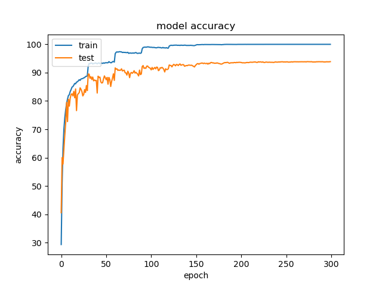
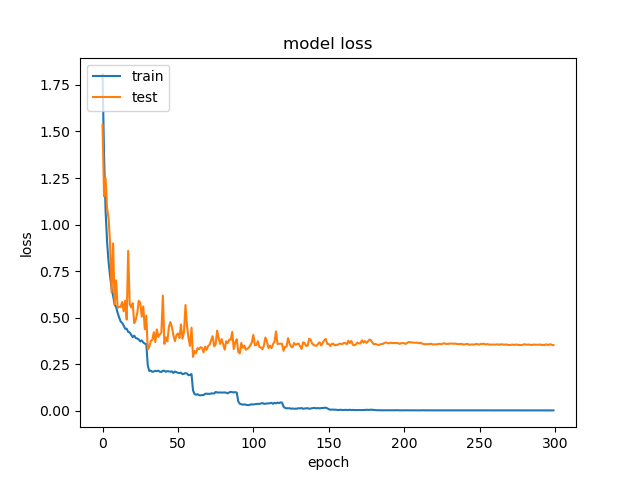

# KnowledgeDistillation

## Training Teacher Network
    python main.py 
## Training Student Network without Knowledge Distillation
    python main.py --student
 You can change hyperparameter settings & model save directory
 
    python main.py --student --save-dir './checkpoints' --alpha 0.9 --temp 3
    
## Results

 Teacher Network Accuracy Graph
 Highest Accuracy : 93.08%
 

 Teacher Network Loss Graph
 
 Student Network without KD VS with KD
 Student Network without KD accuracy : 89.07%
 Student Network with KD accuracy : 88.9%
